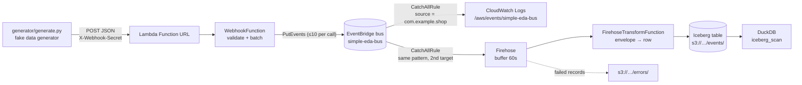

# aws.eda.simple

A small, complete event-driven architecture on AWS:

1. A **fake data generator** (local Python script) POSTs synthetic shop events to a webhook.
2. The webhook is a **Lambda function exposed through a Function URL**, protected by a shared-secret header.
3. The Lambda validates the events and publishes them to a **custom Amazon EventBridge bus** with `PutEvents`.
4. A **catch-all rule** on the bus fans every event out to two targets: a **CloudWatch log group** so you can watch the pipeline work, and an **Amazon Data Firehose** stream so you can keep the events.
5. Firehose reshapes each event with a small transform Lambda and lands it in an **Apache Iceberg table on S3**, registered in the **Glue Data Catalog**.
6. You query the table with **DuckDB** — or Athena, Spark, Trino or PyIceberg, since it is a plain Iceberg table.



Everything is deployed with **AWS SAM** from a single `template.yaml`, with no manual prerequisites beyond AWS credentials. Both Lambdas have **no third-party dependencies** (boto3 ships with the runtime, and the transform needs only the standard library).

## Project layout

```
template.yaml                 SAM template: bus, Lambdas, IAM, rule, log groups, bucket, Glue table, Firehose
samconfig.toml                SAM CLI defaults (stack name, region, non-secret parameters)
Makefile                      install / lint / test / build / deploy / generate / logs / duckdb / delete
src/webhook/app.py            Webhook handler and pure helper functions
src/firehose_transform/app.py Firehose transform: EventBridge envelope -> Iceberg table row
generator/generate.py         Fake data generator CLI (runs locally, not deployed)
tests/                        pytest unit tests (botocore Stubber, no AWS account needed)
events/post.json              Sample Function URL event for `sam local invoke`
events/firehose.json          Sample Firehose records event for `sam local invoke`
env.example.json              Template for local env vars (copy to env.json, git-ignored)
.github/workflows/ci.yml      Lint + tests + `sam validate --lint`
```

## Event contract

The webhook accepts `POST` with `Content-Type: application/json` and the header `X-Webhook-Secret: <secret>`.
The body is **either one event object or a JSON array of them** (up to 100 per request).

```json
{
  "id": "evt_4f9c2a1b6e0d",
  "type": "order.created",
  "timestamp": "2026-09-26T14:47:03Z",
  "data": { "order_id": "ord_1a2b3c", "customer_name": "Ada Lovelace", "total": 19.98, "currency": "GBP", "...": "..." }
}
```

| Field | Rule |
|---|---|
| `id` | non-empty string, max 128 chars |
| `type` | one of `order.created`, `order.updated`, `payment.received` |
| `timestamp` | ISO-8601 with a timezone (`Z` or offset) |
| `data` | JSON object (contents are passed through untouched) |

Each event becomes one EventBridge entry: `source` is fixed per deployment (`EventSource` parameter, never taken from the payload), `detail-type` is the event `type`, `detail` is the whole inbound object, and `time` is the event `timestamp`.

| Response | Meaning |
|---|---|
| `202` | Events validated and sent. Body: `{"accepted": n, "failed": m, "failures": [...]}` (partial EventBridge failures are reported here, not hidden) |
| `400` | Invalid JSON, wrong shape, empty array, too many events, or any event failing validation. Nothing is sent. Body lists every problem. |
| `401` | Missing or wrong `X-Webhook-Secret` |
| `405` | Any method other than `POST` |
| `500` | EventBridge call raised an error (details in the Lambda logs) |

## Prerequisites

- An AWS account and credentials configured for the AWS CLI
- [AWS CLI](https://docs.aws.amazon.com/cli/latest/userguide/getting-started-install.html) and [AWS SAM CLI](https://docs.aws.amazon.com/serverless-application-model/latest/developerguide/install-sam-cli.html)
- Python 3.12 (3.11 also works for local tests) and `make`
- Optional, to query the Iceberg table: the [DuckDB CLI](https://duckdb.org/docs/installation/) (`brew install duckdb`)

No account-level setup is needed — no Lake Formation, no Glue integration to enable. `make deploy` is the whole story.

## Setup

```bash
make install            # creates .venv and installs dev dependencies
source .venv/bin/activate
make lint test          # ruff + 60-odd unit tests, no AWS needed
```

## Deploy

```bash
export WEBHOOK_SECRET=$(openssl rand -hex 24)   # keep this, the generator needs it
make deploy                                     # sam build + sam deploy
make outputs                                    # shows WebhookUrl, bus name, log group
```

`make deploy` refuses to run without `WEBHOOK_SECRET` set. Override the defaults with make variables, e.g. `make deploy REGION=us-east-1 BUS_NAME=my-bus`.
For a first-time interactive deploy you can also use `make deploy-guided`.

## Run the fake data generator

```bash
make generate           # 10 POSTs, 3 events each, every 2 seconds, using the deployed URL
```

or call the script directly:

```bash
python generator/generate.py --url "$(make -s url)" --secret "$WEBHOOK_SECRET" \
    --batch-size 5 --interval 1 --count 20
python generator/generate.py --help
python generator/generate.py --url x --secret x --dry-run --count 1   # print a payload only
```

Options: `--interval` seconds between POSTs, `--count` (0 = until Ctrl-C), `--batch-size` (1 sends a bare object, more sends an array), `--types` to restrict event types, `--seed` for reproducible data. `--url` / `--secret` fall back to `WEBHOOK_URL` / `WEBHOOK_SECRET`.

Example output:

```
[15:02:11] POST 3 event(s) -> 202 accepted=3 failed=0
[15:02:13] POST 3 event(s) -> 202 accepted=3 failed=0
done: 2 request(s), 6 event(s) accepted, 0 request(s) failed
```

## Verify the events arrived

```bash
make logs-events        # tails /aws/events/simple-eda-bus: one line per event on the bus
make logs               # tails the Lambda's own logs (accepted/failed counts per request)
```

A delivered event looks like this in the events log group:

```json
{"version":"0","id":"...","detail-type":"order.created","source":"com.example.shop",
 "time":"2026-09-26T14:47:03Z","detail":{"id":"evt_...","type":"order.created","timestamp":"...","data":{...}}}
```

Quick manual checks with curl:

```bash
URL=$(make -s url)
curl -si "$URL"                                                            # 405
curl -si -X POST "$URL" -d '{}'                                            # 401 (no secret)
curl -si -X POST "$URL" -H "X-Webhook-Secret: $WEBHOOK_SECRET" -d 'nope'   # 400
curl -si -X POST "$URL" -H "X-Webhook-Secret: $WEBHOOK_SECRET" \
     -H 'Content-Type: application/json' \
     -d '{"id":"evt_1","type":"order.created","timestamp":"2026-09-26T14:47:03Z","data":{"order_id":"ord_1"}}'  # 202
```

## Query the events in the Iceberg table

Firehose buffers for 60 seconds, so give it a minute after `make generate`, then:

```bash
make errors             # should report none: anything here failed to deliver
make duckdb             # opens the DuckDB prompt with an `events` view over the table
```

`make duckdb` leaves you at DuckDB's interactive prompt (`memory D`), with the Glue catalog attached and
an `events` view ready. Type SQL, and `.quit` to leave.

```sql
SELECT count(*) FROM events;
SELECT event_type, count(*) FROM events GROUP BY 1 ORDER BY 2 DESC;

SELECT event_time,
       event_type,
       json_extract_string(detail, '$.data.order_id')          AS order_id,
       CAST(json_extract_string(detail, '$.data.total') AS DOUBLE) AS total
FROM   events
WHERE  event_type = 'order.created'
ORDER  BY event_time DESC
LIMIT  10;
```

`make duckdb` is a thin wrapper over an `ATTACH` of the Glue catalog. IAM is the only thing gating it —
there is no Lake Formation in the picture:

```sql
INSTALL aws; INSTALL httpfs; INSTALL iceberg; LOAD aws; LOAD iceberg;
CREATE SECRET (TYPE s3, PROVIDER credential_chain, REGION 'eu-west-1');
ATTACH '<account-id>' AS lake (TYPE iceberg, ENDPOINT_TYPE glue);
SELECT * FROM lake.shop_events.events;
```

The catalog is what makes this work: it holds the pointer to the table's current metadata file. Reading
straight from the prefix instead — `iceberg_scan('s3://<bucket>/events/')` — fails with *"no version was
provided and no version-hint could be found"*, because DuckDB will not guess the latest snapshot unless
you set `unsafe_enable_version_guessing`. Point `iceberg_scan` at a specific
`events/metadata/*.metadata.json` if you want a catalog-free read of a known snapshot.

Either way it is an ordinary Iceberg table, so Athena, Spark, Trino and PyIceberg read it with no extra
setup.

### Table schema

Six columns. The envelope is flattened into typed columns and the payload is kept as raw JSON, so a new
event type or a new field inside `data` can never break ingestion.

| Column | Type | From |
|---|---|---|
| `event_id` | string | `detail.id` — the business event id (`evt_…`) |
| `event_type` | string | EventBridge `detail-type` |
| `source` | string | EventBridge `source` |
| `event_time` | timestamp | EventBridge `time`, normalised to UTC |
| `ingest_time` | timestamp | set by the transform; `ingest_time - event_time` is pipeline lag |
| `detail` | string | the whole inbound event as JSON |

The table is **unpartitioned**: CloudFormation can only express Hive-style partition keys for a Glue
table, not an Iceberg partition spec. Add one when it earns its keep, from any Iceberg engine:

```sql
ALTER TABLE shop_events.events ADD PARTITION FIELD day(event_time);
```

### Compaction

Firehose commits every 60 seconds, so the table accumulates small Parquet files. Compaction is
deliberately **not** enabled: it bills Glue DPU hours, and at a few events per second it would run
continuously over a toy dataset for no query benefit. When there is enough data for file count to hurt,
add one resource — `AWS::Glue::TableOptimizer` with a `binpack` `CompactionConfiguration`, plus an IAM
role for Glue to run it. Matching optimizers exist for snapshot retention and orphan-file removal.

## Local development

- `make lint`, `make fmt`, `make test`, `make validate` (`sam validate --lint`).
- `make invoke-local` runs the webhook handler in a local container with `events/post.json`. Copy `env.example.json` to `env.json` first. Note that the handler still calls **real** EventBridge with your local credentials, so the bus must already exist (deploy first) or you will get a `500`.
- `make invoke-local-transform` runs the Firehose transform with `events/firehose.json`. This one calls no AWS APIs at all, so it works **fully offline** and prints the exact rows Firehose would write.
- `sam local start-api` does **not** serve Lambda Function URLs, so it is not useful here.

Firehose itself cannot be run locally, so the buffered write and the Iceberg commit are only exercised in
AWS. Everything either side of it is covered by `make test` and the two local invokes.

## Security notes

- The Function URL is public; the shared secret header is the only gate. Comparison is constant-time and the secret is never logged. Rotate it by redeploying with a new `WEBHOOK_SECRET`.
- The secret is stored as a Lambda environment variable (`NoEcho` in CloudFormation). For production, move it to SSM Parameter Store or Secrets Manager, or switch the Function URL to `AuthType: AWS_IAM`.
- The function's IAM role can only call `events:PutEvents` on this one bus.
- If you need WAF, throttling or custom domains, put an API Gateway HTTP API in front of the function instead of a Function URL.
- The lake bucket blocks all public access and is encrypted with SSE-S3. The Firehose role can only touch that one bucket, that one Glue table and the transform function; the EventBridge target role can only put records to that one stream.

## Tear down

```bash
make empty-bucket       # required: CloudFormation cannot delete a bucket that still has objects
make delete             # sam delete, removes the stack including log groups and the resource policy
```

`make empty-bucket` deletes the Iceberg table data, so it is deliberately a separate step rather than
chained into `make delete`. Nothing is left behind in the account afterwards.

## How it works (implementation notes)

- `src/webhook/app.py` is split into small pure functions (`is_authorized`, `parse_body`, `validate_event`, `to_entry`, `chunk`, `put_events`) so the whole request path is unit-tested with botocore's `Stubber`, including EventBridge partial failures.
- `PutEvents` accepts at most 10 entries per call, so requests are chunked; failures are reported with their index in the original request.
- The CloudWatch Logs target needs an `AWS::Logs::ResourcePolicy` allowing `events.amazonaws.com` to write to the log group. Without it the rule deploys but silently delivers nothing.
- `tests/test_generator.py` feeds the generator's output through the Lambda's own `validate_event`, so the two sides of the contract cannot drift apart.
