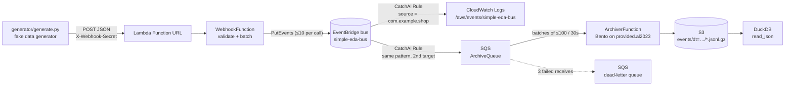

# aws.eda.simple

A small, complete event-driven architecture on AWS that also runs, end to end, on your laptop:

1. A **fake data generator** (local Python script) POSTs synthetic shop events to a webhook.
2. The webhook is a **Lambda function exposed through a Function URL**, protected by a shared-secret header.
3. The Lambda validates the events and publishes them to a **custom Amazon EventBridge bus** with `PutEvents`.
4. A **catch-all rule** on the bus fans every event out to two targets: a **CloudWatch log group** so you can watch the pipeline work, and an **SQS queue** so you can keep the events.
5. An **archiver Lambda** drains the queue in batches and writes each batch to **S3 as gzipped JSON Lines** - the bus envelope, byte for byte, nothing transformed. It is a [**Bento**](https://warpstreamlabs.github.io/bento/) stream running as a Lambda: a YAML config and Bento's own binary, no code of ours.
6. You query the archive with **DuckDB**, straight from the files. Any engine that reads JSON on S3 can do the same.



Everything is deployed with **AWS SAM** from a single `template.yaml`, with no prerequisites beyond AWS credentials - or into **Floci**, a free local AWS emulator, with no AWS account at all. The webhook Lambda is plain Python with **no third-party dependencies** (boto3 ships with the runtime); the archiver is a Bento config plus Bento's Lambda build, which `sam build` downloads.

This branch is the **Bento experiment**: the archiver was rewritten from Python to a Bento stream to see whether the solution gets better. The verdict, and why the webhook stayed Python, is in [bento.md](bento.md).

## Project layout

```
template.yaml               SAM template: bus, Lambdas, IAM, rule, log groups, bucket, queues
samconfig.toml              SAM CLI defaults; [local] env targets Floci
mise.toml                   Every tool, pinned: python, task, duckdb, awscli, sam, samlocal, bento
Taskfile.yml                Every command: `task --list`. CI calls the same tasks you do
src/webhook/app.py          Webhook handler and pure helper functions
src/archiver/archiver.yaml  Archiver, as a Bento stream: SQS batch of bus envelopes -> one gzipped JSON Lines file on S3
src/archiver/*_bento_test.yaml  Unit tests for that config, run by `bento test`
src/archiver/Makefile       `sam build` recipe: fetch the pinned Bento Lambda binary, stage it with the config
bento.md                    The evaluation: what Bento improved, what it cost, why the webhook is still Python
generator/generate.py       Fake data generator CLI (runs locally, not deployed)
queries/views.sql           DuckDB views over the archive (events, orders, order_items, payments)
queries/examples.sql        Example analytical queries, runnable with `task query`
guide.md                    Build this yourself: the solution as nine ordered tasks, with the gotchas
tests/                      pytest unit tests for the webhook, generator and views (botocore Stubber + DuckDB, no AWS)
events/post.json            Sample Function URL event for `sam local invoke`
events/sqs.json             Sample SQS batch for `sam local invoke`
env.example.json            Template for local env vars (copy to env.json, git-ignored)
.github/workflows/ci.yml    `task ci`, then `task local:e2e` - nothing that only exists in CI
```

## Event contract

The webhook accepts `POST` with `Content-Type: application/json` and the header `X-Webhook-Secret: <secret>`.
The body is **either one event object or a JSON array of them** (up to 100 per request).

```json
{
  "id": "evt_4f9c2a1b6e0d",
  "type": "order.created",
  "timestamp": "2026-09-26T14:47:03Z",
  "data": { "order_id": "ord_1a2b3c", "customer_name": "Ada Lovelace", "total": 19.98, "currency": "GBP", "...": "..." }
}
```

| Field | Rule |
|---|---|
| `id` | non-empty string, max 128 chars |
| `type` | one of `order.created`, `order.updated`, `payment.received` |
| `timestamp` | ISO-8601 with a timezone (`Z` or offset) |
| `data` | JSON object (contents are passed through untouched) |

Each event becomes one EventBridge entry: `source` is fixed per deployment (`EventSource` parameter, never taken from the payload), `detail-type` is the event `type`, `detail` is the whole inbound object, and `time` is the event `timestamp`.

| Response | Meaning |
|---|---|
| `202` | Events validated and sent. Body: `{"accepted": n, "failed": m, "failures": [...]}` (partial EventBridge failures are reported here, not hidden) |
| `400` | Invalid JSON, wrong shape, empty array, too many events, or any event failing validation. Nothing is sent. Body lists every problem. |
| `401` | Missing or wrong `X-Webhook-Secret` |
| `405` | Any method other than `POST` |
| `500` | EventBridge call raised an error (details in the Lambda logs) |

## Prerequisites

- [mise](https://mise.jdx.dev) - it installs everything else from `mise.toml`: Python 3.12, `task`, `duckdb`, Harlequin, the AWS CLI, SAM, `samlocal` and the `bento` CLI
- `curl`, `unzip` and `make` - `sam build` uses them to fetch the Bento Lambda binary (present on macOS and every Linux)
- To deploy to AWS: an AWS account and credentials configured for the AWS CLI
- To run it locally instead: Docker. [Floci](https://floci.io) needs no account and no token

No account-level setup is needed for AWS. `task deploy` is the whole story.

## Setup

```bash
mise install            # tools from mise.toml
task install            # creates .venv and installs dev dependencies
task ci                 # ruff + bento lint, 70-odd pytest tests + 8 bento tests, sam validate; no AWS needed
task --list             # everything else
```

Every command below is a `task`; CI runs the very same tasks, so if it works for you it works there.

## Run the whole thing locally

The pipeline runs unchanged in [Floci](https://floci.io), a free open-source AWS emulator: same template, same Lambdas, same
generator, same DuckDB queries. No AWS account, no secret to generate.

```bash
task local:e2e          # up, deploy, generate, wait, verify - then tears Floci down
```

or step by step, leaving Floci up to poke at:

```bash
task local:up           # docker run floci/floci, healthy in a few seconds
task local:deploy       # samlocal build + deploy (samconfig.toml [local] env)
task local:generate     # 10 POSTs, 3 events each, at the local Function URL
sleep 60                # the archiver batches for up to 30s, and its first start copies a 245 MB binary
task local:verify       # DuckDB counts the archived events: expects 30
task local:query        # runs queries/examples.sql over the local archive
task local:duckdb       # or interactively
task local:resources    # and everything under "Look inside" below has a local: twin
task local:down
```

`task local:generate` posts to `localhost:4566` with the Function URL's hostname in the `Host` header, which is
how Function URLs are routed anyway. Floci's URLs use a `<id>.lambda-url.<region>.localhost:4566` hostname, which
resolves without DNS on most systems, so the plain URL works too; the header route is kept because it is
emulator-independent.

`task local:up` is a plain `docker run` of `floci/floci:latest` with the Docker socket mounted (Lambda runs in
real containers) and `FLOCI_DEFAULT_REGION` set. Floci runs functions on the host's native architecture, so the
`arm64` functions run on an x86 CI runner without any flag. CI runs `task local:e2e` on every push with no
secrets at all - see `.github/workflows/ci.yml`.

### Floci parity notes

Floci 2.1.0 runs this pipeline end to end - webhook, bus, queue, archiver, S3, DuckDB - with these gaps, each
found by running it and visible in `docker logs floci-main` or the resource list:

| Gap | Effect | What this repo does about it |
|---|---|---|
| SAM's `FunctionUrlConfig` is not expanded | no Function URL; the `WebhookUrl` output comes back unresolved | the template declares `AWS::Lambda::Url` + `AWS::Lambda::Permission` explicitly - exactly what SAM generates on AWS, verified by redeploying there |
| CloudFormation drops `MaximumBatchingWindowInSeconds` and `FunctionResponseTypes` from the event source mapping | one archiver invocation per event | `task local:deploy` re-applies both through the Lambda API; the window then works (one file per 30s batch) |
| `ReportBatchItemFailures` is ignored at runtime | a message the archiver rejects is dropped with its batch instead of retried and dead-lettered | nothing possible from here; `task local:errors` will always report 0 |
| EventBridge → CloudWatch Logs target unsupported | `task local:logs:events` shows nothing | the archive is the record: `task local:logs:archiver` and `task local:archive` show the flow |
| Functions run on the host's architecture, not the template's `arm64` (by design; `FLOCI_SERVICES_LAMBDA_HONOUR_ARCHITECTURES` needs QEMU) | invisible for Python; the archiver's Bento binary is native and must match | `task local:deploy` builds with `BENTO_ARCH` set to the host's architecture, into its own build *and* cache directory - SAM's build cache keys on source only and would happily reuse an arm64 binary for an x86 host |

None of these affect AWS. If you need to exercise the dead-letter path or the log-group tail locally, the
LocalStack variant of this repo (`feat/sqs-archiver`, PR #2) does both faithfully, at the cost of an auth token
and a much slower start.

## Deploy to AWS

```bash
export WEBHOOK_SECRET=$(openssl rand -hex 24)   # keep this, the generator needs it
task deploy                                     # sam build + sam deploy
task outputs                                    # shows WebhookUrl, bucket, queue URLs
```

Secrets can live in a `.env` file at the repo root instead of your shell - it is gitignored and the Taskfile
loads it (`dotenv`). Put `WEBHOOK_SECRET=...` there once and every task sees it; CI has no `.env` and needs no
secrets.

`task deploy` refuses to run without `WEBHOOK_SECRET` set. Override the defaults with task variables, e.g. `task deploy REGION=us-east-1 BUS_NAME=my-bus`.
For a first-time interactive deploy you can also use `task deploy:guided`.

## Run the fake data generator

```bash
task generate           # 10 POSTs, 3 events each, every 2 seconds, using the deployed URL
```

or call the script directly:

```bash
python generator/generate.py --url "$(task url)" --secret "$WEBHOOK_SECRET" \
    --batch-size 5 --interval 1 --count 20
python generator/generate.py --help
python generator/generate.py --url x --secret x --dry-run --count 1   # print a payload only
```

Options: `--interval` seconds between POSTs, `--count` (0 = until Ctrl-C), `--batch-size` (1 sends a bare object, more sends an array), `--types` to restrict event types, `--seed` for reproducible data, `--host` to override the HTTP Host header. `--url` / `--secret` / `--host` fall back to `WEBHOOK_URL` / `WEBHOOK_SECRET` / `WEBHOOK_HOST`.

Example output:

```
[15:02:11] POST 3 event(s) -> 202 accepted=3 failed=0
[15:02:13] POST 3 event(s) -> 202 accepted=3 failed=0
done: 2 request(s), 6 event(s) accepted, 0 request(s) failed
```

## Look inside

Every inspection task exists twice: plain for AWS, `local:` for Floci. Same command underneath,
different endpoint.

| AWS | Floci | Shows |
|---|---|---|
| `task outputs` | `task local:outputs` | stack outputs: webhook URL, bucket, queue URLs |
| `task resources` | `task local:resources` | every resource in the stack, with type and status |
| `task logs` | `task local:logs` | the webhook Lambda's logs (accepted/failed per request) |
| `task logs:events` | `task local:logs:events` | one line per event on the bus, via the catch-all rule |
| `task logs:archiver` | `task local:logs:archiver` | one line per batch the archiver wrote, with the S3 key |
| `task queues` | `task local:queues` | visible and in-flight depth of the archive queue and its DLQ |
| `task errors` | `task local:errors` | dead-letter depth - "no delivery errors" is what you want |
| `task archive` | `task local:archive` | the archive files on S3, with a total |
| `task duckdb` / `task query` | `task local:duckdb` / `task local:query` | query the archive at the DuckDB prompt, or run a SQL file |
| `task harlequin` | `task local:harlequin` | query the archive in [Harlequin](https://harlequin.sh), a SQL IDE in the terminal, views preloaded |
| - | `task local:health` | which Floci services are up |

The `logs*` tasks follow by default; `task logs:archiver FOLLOW=` prints the last ten minutes and exits,
which is handy in scripts.

A delivered event looks like this in the events log group, and identically in the archive:

```json
{"version":"0","id":"...","detail-type":"order.created","source":"com.example.shop",
 "time":"2026-09-26T14:47:03Z","detail":{"id":"evt_...","type":"order.created","timestamp":"...","data":{...}}}
```

Quick manual checks with curl:

```bash
URL=$(task url)
curl -si "$URL"                                                            # 405
curl -si -X POST "$URL" -d '{}'                                            # 401 (no secret)
curl -si -X POST "$URL" -H "X-Webhook-Secret: $WEBHOOK_SECRET" -d 'nope'   # 400
curl -si -X POST "$URL" -H "X-Webhook-Secret: $WEBHOOK_SECRET" \
     -H 'Content-Type: application/json' \
     -d '{"id":"evt_1","type":"order.created","timestamp":"2026-09-26T14:47:03Z","data":{"order_id":"ord_1"}}'  # 202
```

## Query the archive

The archiver batches for up to 30 seconds, so give it a minute after `task generate`, then:

```bash
task errors             # should report none
task duckdb             # opens the DuckDB prompt with the views from queries/views.sql loaded
task harlequin          # the same, in Harlequin - a SQL IDE in the terminal with a results grid
task query              # runs queries/examples.sql and prints the results
task query QUERY_FILE=queries/views.sql     # or any other file
```

```sql
SELECT count(*) FROM events;
SELECT event_type, count(*) FROM events GROUP BY 1 ORDER BY 2 DESC;
SELECT sku, sum(qty) AS units FROM order_items GROUP BY 1 ORDER BY 2 DESC LIMIT 5;
```

### How the archive is laid out

```
s3://<bucket>/events/dt=2026-09-27/2026-09-27T20-51-46Z-<uuid>.jsonl.gz
```

One file per archiver invocation: up to 100 events or 30 seconds' worth, whichever came first. Each line is one
EventBridge envelope exactly as the bus delivered it - the bytes of the SQS message body, not a re-serialisation.
`dt=` is a Hive-style partition DuckDB prunes on; the timestamp in the name is when the batch was written. The
uuid stands in for the Lambda request id, which Bento does not see.

### How DuckDB reads it

`queries/views.sql` reads the archive location from a DuckDB variable, so the same file serves S3, Floci
and the test suite's temp directory. `task duckdb` does this for you:

```sql
INSTALL httpfs; LOAD httpfs;
CREATE OR REPLACE SECRET (TYPE s3, PROVIDER credential_chain, REGION 'eu-west-1');
SET VARIABLE archive = 's3://<bucket>/events/**/*.jsonl.gz';
.read queries/views.sql
```

The `events` view is where envelope names become column names (`detail-type` → `event_type`, `time` →
`event_time`) and where **at-least-once delivery becomes exactly-once reading**: a batch whose S3 write failed
is redelivered by SQS, so an event can land in two files, and the view keeps one copy per envelope `id`.

### Digging into the payload

`detail` is kept as JSON rather than expanded into a struct, so a new event type or a new field inside
`data` can never break a query that doesn't ask for it. Payload fields are extracted at query time, and
`queries/views.sql` does that once:

| View | One row per | Notes |
|---|---|---|
| `events` | event | the envelope, plus `dt` and `archived_at` |
| `orders` | `order.created` event | header fields plus the payload's own `total` |
| `order_items` | **line item** | the `items` array unnested |
| `payments` | `payment.received` event | the same extraction pattern without an array |

Arrays are the only fiddly part. `order.created` carries an `items` array, so it needs unnesting - cast it
to a typed struct once and there is no per-field casting afterwards:

```sql
SELECT e.event_id,
       i.sku, i.qty, i.unit_price
FROM   events e,
       unnest(from_json(json_extract(e.detail, '$.data.items'),
                        '["STRUCT(sku VARCHAR, qty INTEGER, unit_price DOUBLE)"]')) AS t(i)
WHERE  e.event_type = 'order.created';
```

The comma before `unnest()` is a lateral join: one output row per array element, with the parent event's
columns repeated. For quick ad-hoc work you can skip the struct schema and use the arrow operators - `->`
returns JSON, `->>` returns text:

```sql
SELECT item ->> '$.sku' AS sku, CAST(item ->> '$.qty' AS INTEGER) AS qty
FROM   events, unnest(from_json(detail -> '$.data.items', '["JSON"]')) AS t(item)
WHERE  event_type = 'order.created';
```

Only `order.created` has `items`, which is why these filter on `event_type` - without it the other two
types contribute no rows but are still scanned.

### If you need a table later

The archive is the landing zone, not the last word. If you want Iceberg semantics - schema, snapshots, time
travel, a catalog - build a table *from* the archive with DuckDB, PyIceberg or Athena, and leave ingestion
alone. In Athena or Trino the unnest above becomes
`CROSS JOIN UNNEST(CAST(json_extract(detail, '$.data.items') AS ARRAY(ROW(sku VARCHAR, qty INTEGER, unit_price DOUBLE)))) AS t(i)`.

## Local development

- `task lint`, `task fmt`, `task test`, `task validate` (`sam validate --lint`), or all three checks with `task ci`.
- `bento test ./src/...` (part of `task test`) runs `src/archiver/archiver_bento_test.yaml`: Lambda events in,
  the gzipped lines, the object key and the `batchItemFailures` response out. `bento lint` is part of `task lint`.
- `tests/test_archive_query.py` writes archive files in the archiver's format (`tests/helpers.py::pack`) and queries
  them through `queries/views.sql` with the DuckDB Python package - so the SQL is tested offline, against the real
  file format. The Bento tests pin the format from the other side.
- To try the archiver binary itself without Docker, run Bento's `bootstrap` under the
  [Lambda Runtime Interface Emulator](https://github.com/aws/aws-lambda-runtime-interface-emulator) with
  `BENTO_CONFIG_PATH`, `ARCHIVE_BUCKET` and an `AWS_ENDPOINT_URL` pointing at any S3-compatible endpoint, and POST
  `events/sqs.json` to it. That is how the response shapes in `bento.md` were checked.
- `task invoke:webhook` runs the webhook handler in a local container with `events/post.json`. Copy `env.example.json` to `env.json` first. The handler still calls **real** EventBridge with your local credentials, so the bus must already exist (deploy first) or you will get a `500`.
- `task invoke:archiver` does the same for the archiver with `events/sqs.json`; set `ARCHIVE_BUCKET` in `env.json` to a bucket you can write to. The build is `arm64`, so this needs an arm64 host (Apple Silicon) or QEMU. For a fully local run use the Floci targets above instead.
- `sam local start-api` does **not** serve Lambda Function URLs, so it is not useful here.

## Security notes

- The Function URL is public; the shared secret header is the only gate. Comparison is constant-time and the secret is never logged. Rotate it by redeploying with a new `WEBHOOK_SECRET`.
- The secret is stored as a Lambda environment variable (`NoEcho` in CloudFormation). For production, move it to SSM Parameter Store or Secrets Manager, or switch the Function URL to `AuthType: AWS_IAM`.
- The webhook's role can only call `events:PutEvents` on this one bus. The archiver's role can only `s3:PutObject` under `events/` in this one bucket, plus the SQS permissions SAM grants for its event source. EventBridge is allowed to send to the queue only from this rule, via the queue policy.
- The lake bucket blocks all public access and is encrypted with SSE-S3.
- If you need WAF, throttling or custom domains, put an API Gateway HTTP API in front of the function instead of a Function URL.

## Tear down

```bash
task empty-bucket       # required: CloudFormation cannot delete a bucket that still has objects
task delete             # sam delete, removes the stack including log groups and the queue policy
```

`task empty-bucket` deletes the archive, so it is deliberately a separate step rather than chained into
`task delete`. Nothing is left behind in the account afterwards.

## How it works (implementation notes)

- `src/webhook/app.py` is split into small pure functions (`is_authorized`, `parse_body`, `validate_event`, `to_entry`, `chunk`, `put_events`) so the whole request path is unit-tested with botocore's `Stubber`, including EventBridge partial failures.
- `PutEvents` accepts at most 10 entries per call, so requests are chunked; failures are reported with their index in the original request.
- The CloudWatch Logs target needs an `AWS::Logs::ResourcePolicy` and the SQS target needs an `AWS::SQS::QueuePolicy`, both allowing `events.amazonaws.com`. Without either, the rule deploys but that target silently delivers nothing. The queue policy pins `aws:SourceArn` to this one rule, with the ARN built by `!Sub` so the rule can `DependsOn` the policy without a cycle.
- **There is no transform.** Files have no schema to match, so the archiver writes the envelope exactly as delivered and `queries/views.sql` does the renaming. Compare this with feeding a typed table: every consumer of a typed table pays for the schema up front; every consumer of the archive pays only for the fields it reads.
- The archiver is `src/archiver/archiver.yaml`, run by Bento's Lambda build (`bootstrap`, `provided.al2023`): a `mapping` splits the SQS batch into archive lines and failed message ids (kept in metadata), `compress` gzips, and a `switch` output writes to `aws_s3` and answers through `sync_response`, or only answers when nothing was archivable. The Lambda's response is whatever reaches `sync_response`.
- It returns `batchItemFailures` (`ReportBatchItemFailures` on the event source), so a message whose body is not a JSON object is retried and eventually dead-lettered on its own, while the rest of its batch is archived. A failed S3 write is retried by Bento until the Lambda times out, after which SQS redelivers the whole batch - hence the dedupe in the `events` view.
- `sam build` runs `src/archiver/Makefile` (`BuildMethod: makefile`): it downloads the pinned Bento release once into `~/.cache/bento-lambda`, checks its sha256, and stages `bootstrap` plus the config. `BENTO_ARCH` picks the binary (`arm64` for AWS, the host's for Floci).
- The queue is the buffer. Its 14-day retention means a broken archiver loses nothing for two weeks; the dead-letter queue keeps what the archiver rejected three times.
- `tests/test_generator.py` feeds the generator's output through the webhook's own `validate_event`, so the two sides of the contract cannot drift apart. `tests/test_archive_query.py` extends the chain to the end: generator → `to_entry` → bus envelope → archiver → file → DuckDB view, asserting the original event comes back out.
