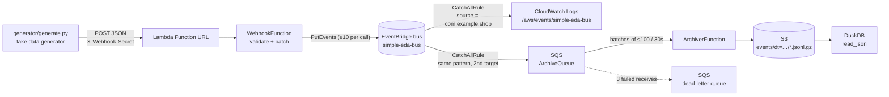

# aws.eda.simple

A small, complete event-driven architecture on AWS that also runs, end to end, on your laptop:

1. A **fake data generator** (local Python script) POSTs synthetic shop events to a webhook.
2. The webhook is a **Lambda function exposed through a Function URL**, protected by a shared-secret header.
3. The Lambda validates the events and publishes them to a **custom Amazon EventBridge bus** with `PutEvents`.
4. A **catch-all rule** on the bus fans every event out to two targets: a **CloudWatch log group** so you can watch the pipeline work, and an **SQS queue** so you can keep the events.
5. An **archiver Lambda** drains the queue in batches and writes each batch to **S3 as gzipped JSON Lines** - the bus envelope, byte for byte, nothing transformed.
6. You query the archive with **DuckDB**, straight from the files. Any engine that reads JSON on S3 can do the same.



Everything is deployed with **AWS SAM** from a single `template.yaml`, with no prerequisites beyond AWS credentials - or into **LocalStack** with no AWS account at all. Both Lambdas have **no third-party dependencies** (boto3 ships with the runtime).

## Project layout

```
template.yaml               SAM template: bus, Lambdas, IAM, rule, log groups, bucket, queues
samconfig.toml              SAM CLI defaults; [local] env targets LocalStack
Makefile                    install / lint / test / build / deploy / generate / logs / duckdb / local-* / delete
src/webhook/app.py          Webhook handler and pure helper functions
src/archiver/app.py         Archiver: SQS batch of bus envelopes -> one gzipped JSON Lines file on S3
generator/generate.py       Fake data generator CLI (runs locally, not deployed)
queries/views.sql           DuckDB views over the archive (events, orders, order_items, payments)
queries/examples.sql        Example analytical queries, runnable with `make query`
tests/                      pytest unit tests (botocore Stubber + DuckDB, no AWS account needed)
events/post.json            Sample Function URL event for `sam local invoke`
events/sqs.json             Sample SQS batch for `sam local invoke`
env.example.json            Template for local env vars (copy to env.json, git-ignored)
.github/workflows/ci.yml    Lint + tests + `sam validate --lint`, then the whole pipeline in LocalStack
```

## Event contract

The webhook accepts `POST` with `Content-Type: application/json` and the header `X-Webhook-Secret: <secret>`.
The body is **either one event object or a JSON array of them** (up to 100 per request).

```json
{
  "id": "evt_4f9c2a1b6e0d",
  "type": "order.created",
  "timestamp": "2026-09-26T14:47:03Z",
  "data": { "order_id": "ord_1a2b3c", "customer_name": "Ada Lovelace", "total": 19.98, "currency": "GBP", "...": "..." }
}
```

| Field | Rule |
|---|---|
| `id` | non-empty string, max 128 chars |
| `type` | one of `order.created`, `order.updated`, `payment.received` |
| `timestamp` | ISO-8601 with a timezone (`Z` or offset) |
| `data` | JSON object (contents are passed through untouched) |

Each event becomes one EventBridge entry: `source` is fixed per deployment (`EventSource` parameter, never taken from the payload), `detail-type` is the event `type`, `detail` is the whole inbound object, and `time` is the event `timestamp`.

| Response | Meaning |
|---|---|
| `202` | Events validated and sent. Body: `{"accepted": n, "failed": m, "failures": [...]}` (partial EventBridge failures are reported here, not hidden) |
| `400` | Invalid JSON, wrong shape, empty array, too many events, or any event failing validation. Nothing is sent. Body lists every problem. |
| `401` | Missing or wrong `X-Webhook-Secret` |
| `405` | Any method other than `POST` |
| `500` | EventBridge call raised an error (details in the Lambda logs) |

## Prerequisites

- Python 3.12 (3.11 also works for local tests) and `make`
- [AWS SAM CLI](https://docs.aws.amazon.com/serverless-application-model/latest/developerguide/install-sam-cli.html)
- To query the archive: the [DuckDB CLI](https://duckdb.org/docs/installation/) (`brew install duckdb`)
- To deploy to AWS: an AWS account and credentials configured for the [AWS CLI](https://docs.aws.amazon.com/cli/latest/userguide/getting-started-install.html)
- To run it locally instead: Docker, plus `pip install localstack aws-sam-cli-local` (the `localstack` CLI and `samlocal`)

No account-level setup is needed for AWS. `make deploy` is the whole story.

## Setup

```bash
make install            # creates .venv and installs dev dependencies
source .venv/bin/activate
make lint test          # ruff + 80-odd unit tests, no AWS needed
```

## Run the whole thing locally

The pipeline runs unchanged in [LocalStack](https://localstack.cloud): same template, same Lambdas, same
generator, same DuckDB queries. No AWS account, no secret to generate.

```bash
make local-up           # starts LocalStack in Docker
make local-deploy       # samlocal build + deploy (samconfig.toml [local] env)
make local-generate     # 10 POSTs, 3 events each, at the local Function URL
sleep 45                # the archiver batches for up to 30s
make local-verify       # DuckDB counts the archived events: expects 30
make local-query        # runs queries/examples.sql over the local archive
make local-duckdb       # or poke at it interactively
make local-down
```

`make local-generate` posts to `localhost:4566` with the Function URL's hostname in the `Host` header, which is
how LocalStack routes Function URLs anyway - so it works even where your resolver refuses the
`*.localhost.localstack.cloud` wildcard (some ISPs block DNS answers that point at 127.0.0.1).

LocalStack now expects an account: export `LOCALSTACK_AUTH_TOKEN` before `make local-up` (the free Hobby
tier is enough; the token lives in your shell, never in the repo). Without one it still starts during
LocalStack's grace period if you set `LOCALSTACK_ACKNOWLEDGE_ACCOUNT_REQUIREMENT=1`. `LAMBDA_IGNORE_ARCHITECTURE=1`
is set for you so the `arm64` functions run on an x86 host. CI runs exactly this sequence on every push, with
the token as a repository secret - see `.github/workflows/ci.yml`.

## Deploy to AWS

```bash
export WEBHOOK_SECRET=$(openssl rand -hex 24)   # keep this, the generator needs it
make deploy                                     # sam build + sam deploy
make outputs                                    # shows WebhookUrl, bucket, queue URLs
```

`make deploy` refuses to run without `WEBHOOK_SECRET` set. Override the defaults with make variables, e.g. `make deploy REGION=us-east-1 BUS_NAME=my-bus`.
For a first-time interactive deploy you can also use `make deploy-guided`.

## Run the fake data generator

```bash
make generate           # 10 POSTs, 3 events each, every 2 seconds, using the deployed URL
```

or call the script directly:

```bash
python generator/generate.py --url "$(make -s url)" --secret "$WEBHOOK_SECRET" \
    --batch-size 5 --interval 1 --count 20
python generator/generate.py --help
python generator/generate.py --url x --secret x --dry-run --count 1   # print a payload only
```

Options: `--interval` seconds between POSTs, `--count` (0 = until Ctrl-C), `--batch-size` (1 sends a bare object, more sends an array), `--types` to restrict event types, `--seed` for reproducible data, `--host` to override the HTTP Host header. `--url` / `--secret` / `--host` fall back to `WEBHOOK_URL` / `WEBHOOK_SECRET` / `WEBHOOK_HOST`.

Example output:

```
[15:02:11] POST 3 event(s) -> 202 accepted=3 failed=0
[15:02:13] POST 3 event(s) -> 202 accepted=3 failed=0
done: 2 request(s), 6 event(s) accepted, 0 request(s) failed
```

## Watch the events flow

```bash
make logs-events        # tails /aws/events/simple-eda-bus: one line per event on the bus
make logs               # tails the webhook's own logs (accepted/failed counts per request)
make logs-archiver      # tails the archiver: one line per batch written, with the S3 key
make errors             # dead-letter queue depth - "no delivery errors" is what you want
```

A delivered event looks like this in the events log group, and identically in the archive:

```json
{"version":"0","id":"...","detail-type":"order.created","source":"com.example.shop",
 "time":"2026-09-26T14:47:03Z","detail":{"id":"evt_...","type":"order.created","timestamp":"...","data":{...}}}
```

Quick manual checks with curl:

```bash
URL=$(make -s url)
curl -si "$URL"                                                            # 405
curl -si -X POST "$URL" -d '{}'                                            # 401 (no secret)
curl -si -X POST "$URL" -H "X-Webhook-Secret: $WEBHOOK_SECRET" -d 'nope'   # 400
curl -si -X POST "$URL" -H "X-Webhook-Secret: $WEBHOOK_SECRET" \
     -H 'Content-Type: application/json' \
     -d '{"id":"evt_1","type":"order.created","timestamp":"2026-09-26T14:47:03Z","data":{"order_id":"ord_1"}}'  # 202
```

## Query the archive

The archiver batches for up to 30 seconds, so give it a minute after `make generate`, then:

```bash
make errors             # should report none
make duckdb             # opens the DuckDB prompt with the views from queries/views.sql loaded
make query              # runs queries/examples.sql and prints the results
make query QUERY_FILE=queries/views.sql     # or any other file
```

```sql
SELECT count(*) FROM events;
SELECT event_type, count(*) FROM events GROUP BY 1 ORDER BY 2 DESC;
SELECT sku, sum(qty) AS units FROM order_items GROUP BY 1 ORDER BY 2 DESC LIMIT 5;
```

### How the archive is laid out

```
s3://<bucket>/events/dt=2026-09-27/2026-09-27T20-51-46Z-<lambda-request-id>.jsonl.gz
```

One file per archiver invocation: up to 100 events or 30 seconds' worth, whichever came first. Each line is one
EventBridge envelope exactly as the bus delivered it. `dt=` is a Hive-style partition DuckDB prunes on; the
timestamp in the name is when the batch was written.

### How DuckDB reads it

`queries/views.sql` reads the archive location from a DuckDB variable, so the same file serves S3, LocalStack
and the test suite's temp directory. `make duckdb` does this for you:

```sql
INSTALL httpfs; LOAD httpfs;
CREATE OR REPLACE SECRET (TYPE s3, PROVIDER credential_chain, REGION 'eu-west-1');
SET VARIABLE archive = 's3://<bucket>/events/**/*.jsonl.gz';
.read queries/views.sql
```

The `events` view is where envelope names become column names (`detail-type` → `event_type`, `time` →
`event_time`) and where **at-least-once delivery becomes exactly-once reading**: a batch whose S3 write failed
is redelivered by SQS, so an event can land in two files, and the view keeps one copy per envelope `id`.

### Digging into the payload

`detail` is kept as JSON rather than expanded into a struct, so a new event type or a new field inside
`data` can never break a query that doesn't ask for it. Payload fields are extracted at query time, and
`queries/views.sql` does that once:

| View | One row per | Notes |
|---|---|---|
| `events` | event | the envelope, plus `dt` and `archived_at` |
| `orders` | `order.created` event | header fields plus the payload's own `total` |
| `order_items` | **line item** | the `items` array unnested |
| `payments` | `payment.received` event | the same extraction pattern without an array |

Arrays are the only fiddly part. `order.created` carries an `items` array, so it needs unnesting - cast it
to a typed struct once and there is no per-field casting afterwards:

```sql
SELECT e.event_id,
       i.sku, i.qty, i.unit_price
FROM   events e,
       unnest(from_json(json_extract(e.detail, '$.data.items'),
                        '["STRUCT(sku VARCHAR, qty INTEGER, unit_price DOUBLE)"]')) AS t(i)
WHERE  e.event_type = 'order.created';
```

The comma before `unnest()` is a lateral join: one output row per array element, with the parent event's
columns repeated. For quick ad-hoc work you can skip the struct schema and use the arrow operators - `->`
returns JSON, `->>` returns text:

```sql
SELECT item ->> '$.sku' AS sku, CAST(item ->> '$.qty' AS INTEGER) AS qty
FROM   events, unnest(from_json(detail -> '$.data.items', '["JSON"]')) AS t(item)
WHERE  event_type = 'order.created';
```

Only `order.created` has `items`, which is why these filter on `event_type` - without it the other two
types contribute no rows but are still scanned.

### If you need a table later

The archive is the landing zone, not the last word. If you want Iceberg semantics - schema, snapshots, time
travel, a catalog - build a table *from* the archive with DuckDB, PyIceberg or Athena, and leave ingestion
alone. In Athena or Trino the unnest above becomes
`CROSS JOIN UNNEST(CAST(json_extract(detail, '$.data.items') AS ARRAY(ROW(sku VARCHAR, qty INTEGER, unit_price DOUBLE)))) AS t(i)`.

## Local development

- `make lint`, `make fmt`, `make test`, `make validate` (`sam validate --lint`).
- `tests/test_archive_query.py` writes archive files with the archiver's own code and queries them through
  `queries/views.sql` with the DuckDB Python package - so the SQL is tested offline, against the real file format.
- `make invoke-local` runs the webhook handler in a local container with `events/post.json`. Copy `env.example.json` to `env.json` first. The handler still calls **real** EventBridge with your local credentials, so the bus must already exist (deploy first) or you will get a `500`.
- `make invoke-local-archiver` does the same for the archiver with `events/sqs.json`; set `ARCHIVE_BUCKET` in `env.json` to a bucket you can write to. For a fully local run use the LocalStack targets above instead.
- `sam local start-api` does **not** serve Lambda Function URLs, so it is not useful here.

## Security notes

- The Function URL is public; the shared secret header is the only gate. Comparison is constant-time and the secret is never logged. Rotate it by redeploying with a new `WEBHOOK_SECRET`.
- The secret is stored as a Lambda environment variable (`NoEcho` in CloudFormation). For production, move it to SSM Parameter Store or Secrets Manager, or switch the Function URL to `AuthType: AWS_IAM`.
- The webhook's role can only call `events:PutEvents` on this one bus. The archiver's role can only `s3:PutObject` under `events/` in this one bucket, plus the SQS permissions SAM grants for its event source. EventBridge is allowed to send to the queue only from this rule, via the queue policy.
- The lake bucket blocks all public access and is encrypted with SSE-S3.
- If you need WAF, throttling or custom domains, put an API Gateway HTTP API in front of the function instead of a Function URL.

## Tear down

```bash
make empty-bucket       # required: CloudFormation cannot delete a bucket that still has objects
make delete             # sam delete, removes the stack including log groups and the queue policy
```

`make empty-bucket` deletes the archive, so it is deliberately a separate step rather than chained into
`make delete`. Nothing is left behind in the account afterwards.

## How it works (implementation notes)

- `src/webhook/app.py` is split into small pure functions (`is_authorized`, `parse_body`, `validate_event`, `to_entry`, `chunk`, `put_events`) so the whole request path is unit-tested with botocore's `Stubber`, including EventBridge partial failures.
- `PutEvents` accepts at most 10 entries per call, so requests are chunked; failures are reported with their index in the original request.
- The CloudWatch Logs target needs an `AWS::Logs::ResourcePolicy` and the SQS target needs an `AWS::SQS::QueuePolicy`, both allowing `events.amazonaws.com`. Without either, the rule deploys but that target silently delivers nothing. The queue policy pins `aws:SourceArn` to this one rule, with the ARN built by `!Sub` so the rule can `DependsOn` the policy without a cycle.
- **There is no transform.** Files have no schema to match, so the archiver writes the envelope exactly as delivered and `queries/views.sql` does the renaming. Compare this with feeding a typed table: every consumer of a typed table pays for the schema up front; every consumer of the archive pays only for the fields it reads.
- The archiver returns `batchItemFailures` (`ReportBatchItemFailures` on the event source), so a message whose body is not a JSON object is retried and eventually dead-lettered on its own, while the rest of its batch is archived. An S3 write failure raises, which redelivers the whole batch - hence the dedupe in the `events` view.
- The queue is the buffer. Its 14-day retention means a broken archiver loses nothing for two weeks; the dead-letter queue keeps what the archiver rejected three times.
- `tests/test_generator.py` feeds the generator's output through the webhook's own `validate_event`, so the two sides of the contract cannot drift apart. `tests/test_archive_query.py` extends the chain to the end: generator → `to_entry` → bus envelope → archiver → file → DuckDB view, asserting the original event comes back out.
