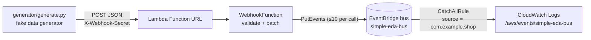

# aws.eda.simple

A small, complete event-driven architecture on AWS:

1. A **fake data generator** (local Python script) POSTs synthetic shop events to a webhook.
2. The webhook is a **Lambda function exposed through a Function URL**, protected by a shared-secret header.
3. The Lambda validates the events and publishes them to a **custom Amazon EventBridge bus** with `PutEvents`.
4. A **catch-all rule** on the bus copies every event to a **CloudWatch log group**, so you can watch the pipeline work end-to-end without writing a consumer.



Everything is deployed with **Terraform** from the `terraform/` directory, to AWS or into **LocalStack** with no AWS account at all. The Lambda has **no third-party dependencies** (boto3 ships with the runtime), so there is no build step: Terraform zips `src/webhook/` itself.

## Project layout

```
terraform/main.tf           Terraform: bus, Lambda + Function URL, IAM, rule, log groups
terraform/variables.tf      Inputs (name, region, bus name, event source, retention, secret)
terraform/outputs.tf        Outputs (webhook URL, bus name/ARN, log group)
terraform/versions.tf       Provider versions and optional S3 backend example
Makefile                    install / lint / test / validate / plan / deploy / generate / logs / delete, plus local-* for LocalStack
src/webhook/app.py          Lambda handler and pure helper functions
generator/generate.py       Fake data generator CLI (runs locally, not deployed)
scripts/invoke_local.py     Runs the handler in-process with a sample event (no SAM needed)
scripts/verify_events.py    End-to-end assertion: the events log group holds exactly the events sent
tests/                      pytest unit tests (botocore Stubber, no AWS account needed)
events/post.json            Sample Function URL event for `make invoke-local`
env.example.json            Template for local env vars (copy to env.json, git-ignored)
.github/workflows/ci.yml    Lint + tests + terraform validate, then the end-to-end run in LocalStack
```

## Event contract

The webhook accepts `POST` with `Content-Type: application/json` and the header `X-Webhook-Secret: <secret>`.
The body is **either one event object or a JSON array of them** (up to 100 per request).

```json
{
  "id": "evt_4f9c2a1b6e0d",
  "type": "order.created",
  "timestamp": "2026-09-26T14:47:03Z",
  "data": { "order_id": "ord_1a2b3c", "customer_name": "Ada Lovelace", "total": 19.98, "currency": "GBP", "...": "..." }
}
```

| Field | Rule |
|---|---|
| `id` | non-empty string, max 128 chars |
| `type` | one of `order.created`, `order.updated`, `payment.received` |
| `timestamp` | ISO-8601 with a timezone (`Z` or offset) |
| `data` | JSON object (contents are passed through untouched) |

Each event becomes one EventBridge entry: `source` is fixed per deployment (`EventSource` parameter, never taken from the payload), `detail-type` is the event `type`, `detail` is the whole inbound object, and `time` is the event `timestamp`.

| Response | Meaning |
|---|---|
| `202` | Events validated and sent. Body: `{"accepted": n, "failed": m, "failures": [...]}` (partial EventBridge failures are reported here, not hidden) |
| `400` | Invalid JSON, wrong shape, empty array, too many events, or any event failing validation. Nothing is sent. Body lists every problem. |
| `401` | Missing or wrong `X-Webhook-Secret` |
| `405` | Any method other than `POST` |
| `500` | EventBridge call raised an error (details in the Lambda logs) |

## Prerequisites

- [Terraform](https://developer.hashicorp.com/terraform/install) 1.5 or newer, Python 3.12 (3.11 also works for local tests) and `make`
- To deploy to AWS: an AWS account and credentials configured for the [AWS CLI](https://docs.aws.amazon.com/cli/latest/userguide/getting-started-install.html)
- To run it locally instead: Docker and a free [LocalStack](https://app.localstack.cloud) auth token

## Setup

```bash
make install            # creates .venv and installs dev dependencies
source .venv/bin/activate
make lint test          # ruff + 60-odd unit tests, no AWS needed
```

## Run the whole thing locally (LocalStack)

The pipeline runs unchanged in [LocalStack](https://localstack.cloud): same Terraform, same Lambda, same
generator. No AWS account, no secret to generate. This is also the end-to-end test CI runs on every push.

```bash
export LOCALSTACK_AUTH_TOKEN=...   # free tier is fine; see below
make local-e2e                     # up, deploy, generate, verify - then tears LocalStack down
```

or step by step, leaving LocalStack up to poke at:

```bash
make local-up           # docker run localstack/localstack, waits for healthy
make local-deploy       # terraform apply with -var aws_endpoint_url=http://localhost:4566, workspace "local"
make local-generate     # 10 POSTs, 3 events each, at the local Function URL
make local-verify       # polls /aws/events/simple-eda-bus until 30 well-formed, unique events arrive
make local-logs-events  # print every event on the local bus
make local-logs         # print the local Lambda's logs
make local-down
```

The Terraform variable `aws_endpoint_url` is all that differs: when set, the AWS provider uses dummy credentials, skips
its AWS-only checks and sends every API call to that URL. LocalStack state lives in its own Terraform workspace
(`local`, under `terraform/terraform.tfstate.d/`, git-ignored) so it never mixes with the AWS state.

`make local-generate` posts to `localhost:4566` with the Function URL's hostname in the `Host` header (the
generator's `--host` flag), which is how LocalStack routes Function URLs anyway, so it works even where your
resolver refuses the `*.localhost.localstack.cloud` wildcard.

`make local-up` is a plain `docker run` of `localstack/localstack`. LocalStack needs an **auth token even on its
free Hobby tier** (the image exits with "License activation failed" without one), so create an account at
[app.localstack.cloud](https://app.localstack.cloud) and export `LOCALSTACK_AUTH_TOKEN` first. The token lives in
your shell (or a CI secret), never in git. `LAMBDA_IGNORE_ARCHITECTURE=1` is set for you so the `arm64` function
runs on an x86 host. CI runs `make local-e2e` on every push, with the token as the `LOCALSTACK_AUTH_TOKEN`
repository secret; see `.github/workflows/ci.yml`.

## Deploy to AWS

```bash
export WEBHOOK_SECRET=$(openssl rand -hex 24)   # keep this, the generator needs it
make plan                                       # terraform init + plan (11 resources on first run)
make deploy                                     # terraform apply -auto-approve
make outputs                                    # shows webhook_url, bus name, log group
```

`make deploy` refuses to run without `WEBHOOK_SECRET` set; it is passed to Terraform as the sensitive `webhook_secret` variable via `TF_VAR_webhook_secret`, so it never lands in a file. Override the defaults with make variables, e.g. `make deploy REGION=us-east-1 BUS_NAME=my-bus NAME=my-stack`.

You can also drive Terraform directly:

```bash
cd terraform
terraform init
TF_VAR_webhook_secret=$WEBHOOK_SECRET terraform apply -var bus_name=my-bus
terraform output -raw webhook_url
```

State is local (`terraform/terraform.tfstate`, git-ignored). For anything shared, uncomment and fill in the S3 backend block in `terraform/versions.tf`. `terraform init` also writes `terraform/.terraform.lock.hcl`; commit it once you have run init so everyone uses the same provider builds.

## Run the fake data generator

```bash
make generate           # 10 POSTs, 3 events each, every 2 seconds, using the deployed URL
```

or call the script directly:

```bash
python generator/generate.py --url "$(make -s url)" --secret "$WEBHOOK_SECRET" \
    --batch-size 5 --interval 1 --count 20
python generator/generate.py --help
python generator/generate.py --url x --secret x --dry-run --count 1   # print a payload only
```

Options: `--interval` seconds between POSTs, `--count` (0 = until Ctrl-C), `--batch-size` (1 sends a bare object, more sends an array), `--types` to restrict event types, `--seed` for reproducible data. `--url` / `--secret` fall back to `WEBHOOK_URL` / `WEBHOOK_SECRET`.

Example output:

```
[15:02:11] POST 3 event(s) -> 202 accepted=3 failed=0
[15:02:13] POST 3 event(s) -> 202 accepted=3 failed=0
done: 2 request(s), 6 event(s) accepted, 0 request(s) failed
```

## Verify the events arrived

```bash
make logs-events        # tails /aws/events/simple-eda-bus: one line per event on the bus
make logs               # tails the Lambda's own logs (accepted/failed counts per request)
```

A delivered event looks like this in the events log group:

```json
{"version":"0","id":"...","detail-type":"order.created","source":"com.example.shop",
 "time":"2026-09-26T14:47:03Z","detail":{"id":"evt_...","type":"order.created","timestamp":"...","data":{...}}}
```

Quick manual checks with curl:

```bash
URL=$(make -s url)
curl -si "$URL"                                                            # 405
curl -si -X POST "$URL" -d '{}'                                            # 401 (no secret)
curl -si -X POST "$URL" -H "X-Webhook-Secret: $WEBHOOK_SECRET" -d 'nope'   # 400
curl -si -X POST "$URL" -H "X-Webhook-Secret: $WEBHOOK_SECRET" \
     -H 'Content-Type: application/json' \
     -d '{"id":"evt_1","type":"order.created","timestamp":"2026-09-26T14:47:03Z","data":{"order_id":"ord_1"}}'  # 202
```

## Local development

- `make lint` (ruff + `terraform fmt -check`), `make fmt`, `make test`, `make validate` (`terraform validate`).
- `make invoke-local` runs the handler in-process (`scripts/invoke_local.py`) with `events/post.json`. Copy `env.example.json` to `env.json` first. Note that the handler still calls **real** EventBridge with your local credentials, so the bus must already exist (deploy first) or you will get a `500`.
- Changing anything in `src/webhook/` changes the zip hash, so the next `make deploy` redeploys the function automatically.

## Security notes

- The Function URL is public; the shared secret header is the only gate. Comparison is constant-time and the secret is never logged. Rotate it by redeploying with a new `WEBHOOK_SECRET`.
- The secret is stored as a Lambda environment variable. It is marked `sensitive` in Terraform so it is redacted from plan output, but it is still written to the state file in plain text: protect the state (encrypted S3 backend) accordingly. For production, move it to SSM Parameter Store or Secrets Manager, or switch the Function URL to `authorization_type = "AWS_IAM"`.
- The function's IAM role can only call `events:PutEvents` on this one bus and write to its own log group.
- If you need WAF, throttling or custom domains, put an API Gateway HTTP API in front of the function instead of a Function URL.

## Tear down

```bash
make delete             # terraform destroy, removes everything including log groups and the resource policy
```

## How it works (implementation notes)

- `src/webhook/app.py` is split into small pure functions (`is_authorized`, `parse_body`, `validate_event`, `to_entry`, `chunk`, `put_events`) so the whole request path is unit-tested with botocore's `Stubber`, including EventBridge partial failures.
- `PutEvents` accepts at most 10 entries per call, so requests are chunked; failures are reported with their index in the original request.
- The CloudWatch Logs target needs an `aws_cloudwatch_log_resource_policy` allowing `events.amazonaws.com` to write to the log group. Without it the rule deploys but silently delivers nothing.
- The Lambda log group is created explicitly (with retention) and the function depends on it, so Lambda never auto-creates an unmanaged, never-expiring group.
- The `lambda:InvokeFunctionUrl` permission for principal `*` (which SAM added implicitly) is an explicit `aws_lambda_permission`; without it the public URL returns `403`.
- `tests/test_generator.py` feeds the generator's output through the Lambda's own `validate_event`, so the two sides of the contract cannot drift apart.
- `scripts/verify_events.py` is the end-to-end oracle: it reads the events log group back and checks the count, the `source`, that `detail-type`/`time` mirror the inbound `type`/`timestamp`, and that no `id` was delivered twice.
